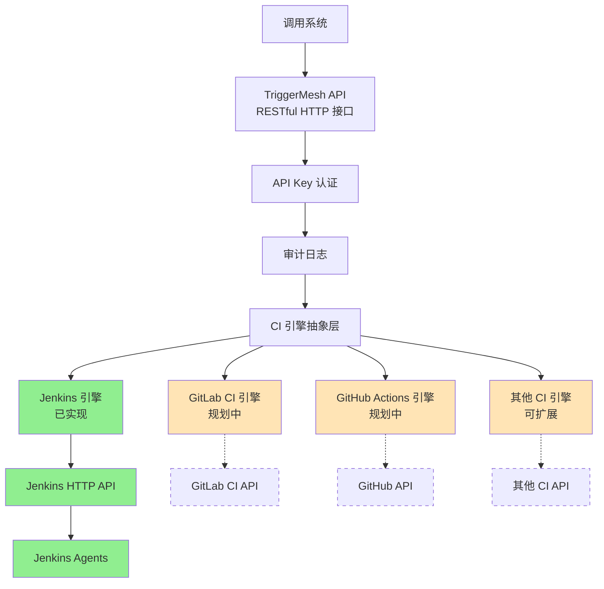

# TriggerMesh

[](https://opensource.org/licenses/MIT)
[](https://golang.org)
[](https://github.com/nesnilnehc/triggermesh/actions)
[](https://codecov.io/gh/nesnilnehc/triggermesh)

TriggerMesh 是一个 轻量级、可控、可审计的 CI Build 触发中枢服务。

## TriggerMesh 是什么？

- 一个 CI Trigger Gateway（CI 触发网关）
- 一个 面向未来多 CI 引擎的抽象层

## 核心能力

- **统一触发接口**：标准化的 HTTP REST API，用于触发 CI 构建，抽象化不同 CI 平台的实现细节
- **API Key 认证**：基于 Bearer Token 的 API Key 认证机制，提供访问控制
- **请求审计**：持久化记录所有触发请求（成功/失败），支持通过 API 查询历史记录
- **CI 引擎抽象层**：可插拔的 CI 引擎接口，支持扩展多种 CI 平台（目前支持 Jenkins，更多引擎规划中）
- **Jenkins 引擎**（当前实现）：支持参数化触发 Jenkins Pipeline/Job，凭证封装在服务内部（Jenkins Token 不对外暴露）

## 整体架构



## 技术选型

- 语言：Golang
- 数据库：SQLite（可平滑升级 PostgreSQL）
- 认证：API Key
- 日志：slog（Go 官方日志库）
- 部署：Docker

## 快速开始

### 安装

#### 方式一：从源码直接运行（推荐用于开发调试）

```bash
# 克隆仓库
git clone https://github.com/nesnilnehc/triggermesh.git
cd triggermesh

# 切换到指定版本（可选）
git checkout v1.0.0

# 安装依赖（依赖都是公共的，无需特殊配置）
go mod tidy

# 直接编译并运行（不安装到系统）
go run ./cmd/triggermesh/main.go --config config.yaml
```

**特点：**

- ✅ 每次运行都会重新编译，自动使用最新代码
- ✅ 适合开发调试，修改代码后直接运行即可看到效果
- ✅ 不会在系统路径安装二进制文件
- ⚠️ 每次运行都需要重新编译，启动稍慢
- ⚠️ 必须在项目目录中运行

#### 方式二：使用 Docker（推荐用于生产环境）

Docker 方式适合生产环境部署和容器化测试。本地开发测试时，推荐使用方式一（从源码直接运行），便于快速修改和调试。

**生产环境部署：**

```bash
# 构建镜像
docker build -t triggermesh:1.0.0 .

# 运行容器
docker run -d -p 8080:8080 \
  -v $(pwd)/config.yaml:/app/config.yaml \
  -v $(pwd)/triggermesh.db:/app/triggermesh.db \
  triggermesh:1.0.0
```

**使用 Docker Compose（推荐）：**

```bash
# 启动服务
docker-compose up -d

# 查看日志
docker-compose logs -f

# 停止服务
docker-compose down
```

**本地 Docker 测试：**

```bash
# 构建并运行（用于测试容器化部署）
docker-compose up --build
```

> **版本信息**：当前最新稳定版本为 [v1.0.0](https://github.com/nesnilnehc/triggermesh/releases/tag/v1.0.0)
> **关于模块路径**：本项目使用 `triggermesh` 作为模块路径，代码中的导入路径为 `triggermesh/internal/...`。由于项目依赖都是公共模块，使用方式一和方式二都无需特殊配置。

### 配置

创建 `config.yaml` 文件：

```yaml
server:
  port: 8080
database:
  path: ./triggermesh.db
# CI 引擎配置
# 目前仅支持 Jenkins。更多引擎将在未来版本中添加。
jenkins:
  url: https://your-jenkins-url
  token: your-jenkins-token
api:
  keys:
    - your-api-key
```

### 运行

```bash
triggermesh --config config.yaml
```

## API 文档

### 触发 CI 构建

目前 TriggerMesh 支持 Jenkins 作为第一个 CI 引擎实现。API 设计支持未来扩展多种 CI 引擎。

#### 触发 Jenkins 构建

```http
POST /api/v1/trigger/jenkins
Content-Type: application/json
Authorization: Bearer your-api-key

{
  "job": "your-job-name",
  "parameters": {
    "param1": "value1",
    "param2": "value2"
  }
}
```

### 响应示例

```json
{
  "id": "123e4567-e89b-12d3-a456-426614174000",
  "status": "success",
  "message": "Jenkins build triggered successfully",
  "buildUrl": "https://your-jenkins-url/job/your-job-name/123/"
}
```

## 配置说明

### 服务器配置

| 配置项      | 类型   | 默认值    | 说明         |
|-----------|--------|-----------|--------------|
| server.port | int    | 8080      | 服务监听端口 |
| server.host | string | 0.0.0.0   | 服务监听地址 |

### 数据库配置

| 配置项        | 类型   | 默认值           | 说明                   |
|-------------|--------|------------------|------------------------|
| database.path | string | ./triggermesh.db | SQLite 数据库文件路径 |

### CI 引擎配置

目前仅支持 Jenkins 引擎。其他 CI 引擎的配置将在实现后添加。

#### Jenkins 配置

| 配置项        | 类型   | 默认值 | 说明              |
|-------------|--------|--------|-------------------|
| jenkins.url   | string | -      | Jenkins 服务器地址 |
| jenkins.token | string | -      | Jenkins API Token |

### API 配置

| 配置项   | 类型      | 默认值 | 说明                    |
|---------|-----------|--------|-------------------------|
| api.keys | []string  | -      | 允许访问的 API Key 列表 |

## 开发指南

### 环境要求

- Go 1.21+ （使用 slog 需要 Go 1.21+）
- SQLite 3+ （可选，用于本地开发）
- Docker （可选，用于容器化测试）

### 开发环境配置

> **说明**：使用方式一（从源码直接运行）和方式二（Docker）都**不需要**特殊配置，因为：
>
> - 已经通过 `git clone` 获取了源码
> - 项目依赖都是公共模块（github.com, gopkg.in），无需访问私有仓库
> - 代码中的导入路径使用模块路径，不涉及 Git 操作

#### 关于导入路径的说明

**关于模块路径：**

本项目使用 `triggermesh` 作为模块路径，代码中的导入路径为 `triggermesh/internal/...`。这是 Go 模块系统的标准做法，用于识别和管理模块。

### 开发流程

1. 克隆仓库
2. 安装依赖：`go mod tidy`
3. 运行测试：`go test ./...`
4. 启动开发服务器：`go run ./cmd/triggermesh/main.go --config config.yaml`

## 测试策略

### 1. 单元测试

- **测试范围**：核心功能模块，如认证、配置管理、CI引擎抽象层等
- **测试框架**：Go标准库`testing`
- **覆盖率目标**：核心功能覆盖率≥80%
- **执行命令**：`go test ./internal/... -cover`
- **Mock策略**：使用`gomock`或`testify/mock`模拟外部依赖

### 2. 集成测试

- **测试范围**：组件间集成，如API+数据库、API+CI引擎集成（目前为Jenkins）等
- **测试框架**：Go标准库`testing` + `testify/assert`
- **执行命令**：`go test ./tests/integration/...`
- **环境要求**：需要实际的SQLite数据库和CI引擎测试实例（目前为Jenkins）
- **测试数据**：使用独立的测试数据库，避免影响生产数据

### 3. 端到端测试

- **测试范围**：完整的请求流程，从API调用到CI引擎触发
- **测试工具**：`curl`或Go HTTP客户端
- **执行命令**：`go test ./tests/e2e/...`
- **环境要求**：完整的TriggerMesh服务实例
- **测试场景**：
  - 正常触发流程
  - 错误处理（无效API Key、无效参数等）
  - 并发请求处理
  - 边界条件测试

### 4. 测试文件结构

```text
tests/
├── unit/               # 单元测试
│   ├── auth_test.go    # 认证模块测试
│   ├── config_test.go  # 配置管理测试
│   └── engine_test.go  # CI引擎抽象层测试
├── integration/        # 集成测试
│   ├── api_test.go     # API集成测试
│   └── jenkins_test.go # Jenkins引擎集成测试
└── e2e/                # 端到端测试
    └── trigger_test.go # 触发流程测试
```

### 5. CI/CD集成

- **CI/CD 工具**：支持 GitLab CI、GitHub Actions 等 CI/CD 平台
- **测试阶段**：
  1. 代码检查（`golint`, `go vet`）
  2. 单元测试
  3. 集成测试（可选，需要测试环境）
  4. 构建Docker镜像
  5. 部署到测试环境

## 项目结构

```text
triggermesh/
├── cmd/
│   └── triggermesh/
│       └── main.go              # 程序入口
├── internal/
│   ├── api/                     # API相关代码
│   │   ├── handlers/            # 请求处理函数
│   │   ├── middleware/          # 中间件
│   │   └── router.go            # 路由配置
│   ├── config/                  # 配置管理
│   ├── engine/                  # CI引擎抽象层
│   │   ├── interface.go         # CI引擎接口
│   │   └── jenkins/             # Jenkins引擎实现
│   ├── logger/                  # 日志系统
│   ├── storage/                 # 存储层
│   │   ├── sqlite.go            # SQLite实现
│   │   └── models/              # 数据模型
│   └── utils/                   # 工具函数
├── pkg/                         # 公共包（未来可能对外暴露）
├── tests/                       # 测试目录
│   ├── unit/                    # 单元测试
│   ├── integration/             # 集成测试
│   └── e2e/                     # 端到端测试
├── config.yaml.example          # 配置示例
├── go.mod                       # 依赖管理
├── Dockerfile                   # Docker配置
├── docker-compose.yml           # Docker Compose配置
├── README.md                    # 项目文档
└── Makefile                     # 构建脚本
```

## 待办事项

### 近期目标

1. **添加测试用例**
   - 单元测试：测试核心功能模块
   - 集成测试：测试组件间的集成
   - 端到端测试：测试完整的请求流程

2. **完善日志系统**
   - 支持日志轮转
   - 支持不同的日志输出格式
   - 支持日志级别配置

3. **添加监控和告警**
   - 监控系统性能指标
   - 监控系统健康状态
   - 添加告警机制

### 远期目标

1. **支持更多CI引擎**
   - GitLab CI
   - GitHub Actions
   - CircleCI
   - Travis CI

2. **实现Web UI管理界面**
   - 配置管理
   - 触发历史查看
   - API Key管理

3. **支持分布式部署**
   - 多实例部署
   - 负载均衡
   - 高可用性

## 文档

**快速开始：**
- [快速开始](#快速开始) - 快速开始使用 TriggerMesh
- [详细教程](docs/tutorial.md) - 完整的中文用户指南
- [API 规范](docs/api/openapi.yaml) - OpenAPI 3.0 规范

**参与贡献：**
- [贡献指南](CONTRIBUTING.md) - 如何参与贡献
- [安全政策](SECURITY.md) - 安全漏洞报告
- [更新日志](CHANGELOG.md) - 版本历史

## 许可证

本项目采用 MIT 许可证。详见 [LICENSE](LICENSE) 文件。
