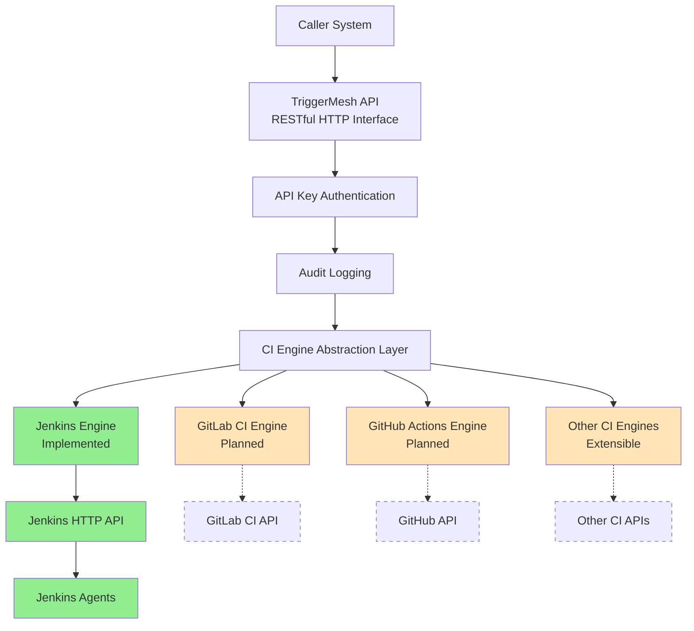

# TriggerMesh

[](https://opensource.org/licenses/MIT)
[](https://golang.org)
[](https://github.com/nesnilnehc/triggermesh/actions)
[](https://codecov.io/gh/nesnilnehc/triggermesh)

TriggerMesh is a lightweight, controllable, and auditable CI Build trigger hub service.

## What is TriggerMesh?

- A CI Trigger Gateway
- An abstraction layer for future multi-CI engine support

## Core Capabilities

- **Unified Trigger API**: Standardized HTTP REST API for triggering CI builds, abstracting platform-specific implementations
- **API Key Authentication**: Bearer token-based API key authentication for secure access control
- **Request Auditing**: Persistent audit logging of all trigger requests (success/failure) with queryable history via API
- **CI Engine Abstraction**: Pluggable CI engine interface enabling support for multiple CI platforms (currently supports Jenkins, with more engines planned)
- **Jenkins Engine** (Current Implementation): Parameterized Jenkins Pipeline/Job triggering with credential encapsulation (Jenkins tokens stored internally, not exposed to clients)

## Architecture



## Technology Stack

- Language: Golang
- Database: SQLite (can be smoothly upgraded to PostgreSQL)
- Authentication: API Key
- Logging: slog (Go official logging library)
- Deployment: Docker

## Quick Start

### Installation

#### Method 1: Run from Source (Recommended for Development)

```bash
# Clone the repository
git clone https://github.com/nesnilnehc/triggermesh.git
cd triggermesh

# Checkout a specific version (optional)
git checkout v1.0.0

# Install dependencies (all dependencies are public, no special configuration needed)
go mod tidy

# Build and run directly (not installed to system)
go run ./cmd/triggermesh/main.go --config config.yaml
```

**Features:**

- ✅ Automatically recompiles on each run, uses latest code
- ✅ Suitable for development and debugging, see results immediately after code changes
- ✅ Binary files are not installed to system paths
- ⚠️ Requires recompilation on each run, slightly slower startup
- ⚠️ Must run from project directory

#### Method 2: Using Docker (Recommended for Production)

Docker method is suitable for production deployment and containerized testing. For local development and testing, Method 1 (run from source) is recommended for quick modifications and debugging.

**Production Deployment:**

```bash
# Build image
docker build -t triggermesh:1.0.0 .

# Run container
docker run -d -p 8080:8080 \
  -v $(pwd)/config.yaml:/app/config.yaml \
  -v $(pwd)/triggermesh.db:/app/triggermesh.db \
  triggermesh:1.0.0
```

**Using Docker Compose (Recommended):**

```bash
# Start service
docker-compose up -d

# View logs
docker-compose logs -f

# Stop service
docker-compose down
```

**Production Deployment:**

For production environments, it's recommended to use pre-built Docker images from GitHub Container Registry instead of building from source. Images are automatically built and pushed when tags are released on GitHub.

> **⚠️ Important**: Image `v1.0.0` has a CGO compilation issue and will fail to initialize the database at runtime. Please use `v1.0.1` or later versions.

**Method 1: Using Production Configuration (Recommended)**

```bash
# 1. Download production configuration files
# You can download docker-compose.prod.yml and config.yaml.example from the GitHub repo
# Or clone the repository (only need config files, not full source code)
git clone https://github.com/nesnilnehc/triggermesh.git
cd triggermesh

# 2. Create configuration file
cp config.yaml.example config.yaml
# Edit config.yaml with your settings (Jenkins URL, Token, API Keys, etc.)

# 3. Create data directory (for database files)
mkdir -p data

# 4. Pull Docker image (optional, docker-compose will pull automatically)
# Defaults to v1.0.1, can specify other version via TRIGGERMESH_VERSION env var
docker pull ghcr.io/nesnilnehc/triggermesh:v1.0.1

# 5. Start service (using production configuration)
docker-compose -f docker-compose.prod.yml up -d

# 6. View logs to confirm service is running
docker-compose -f docker-compose.prod.yml logs -f
```

**Updating to a New Version:**

```bash
# 1. Update image version in docker-compose.prod.yml, or set environment variable
export TRIGGERMESH_VERSION=v1.0.2  # Replace with actual new version

# 2. Pull new version image
docker-compose -f docker-compose.prod.yml pull

# 3. Restart service
docker-compose -f docker-compose.prod.yml up -d
```

**Method 2: Using Development Configuration (For Development/Testing Only)**

If you need to build from source on the server (e.g., to test latest code), use the default `docker-compose.yml`:

```bash
# 1. Clone repository
git clone https://github.com/nesnilnehc/triggermesh.git
cd triggermesh

# 2. Create configuration file
cp config.yaml.example config.yaml
# Edit config.yaml with your settings

# 3. Start service (will build image from source)
docker-compose up -d

# 4. View logs
docker-compose logs -f
```

**About Docker Images:**

- **Image Registry**: `ghcr.io/nesnilnehc/triggermesh`
- **Tag Format**: Version number (e.g., `v1.0.1`) or `latest`
- **Pull Image**: `docker pull ghcr.io/nesnilnehc/triggermesh:v1.0.1`
- **Version Management**: Specify version via `TRIGGERMESH_VERSION` environment variable in `docker-compose.prod.yml`, defaults to `v1.0.1`
- **Image Authentication**: If the image is set to private, you need to login first:
  ```bash
  # Use GitHub username and Personal Access Token
  echo $GITHUB_TOKEN | docker login ghcr.io -u $GITHUB_USERNAME --password-stdin
  ```
  In most cases, public images can be pulled without authentication.

**Local Docker Testing:**

```bash
# Build and run (for testing containerized deployment)
docker-compose up --build
```

> **Version Information**: Current latest stable version is [v1.0.1](https://github.com/nesnilnehc/triggermesh/releases/tag/v1.0.1) (or check [latest release](https://github.com/nesnilnehc/triggermesh/releases/latest))
> 
> **⚠️ Note**: Version `v1.0.0` has a CGO compilation issue and should not be used.
> **About Module Path**: This project uses `triggermesh` as the module path, with import paths in code as `triggermesh/internal/...`. Since all project dependencies are public modules, both Method 1 and Method 2 require no special configuration.

### Configuration

Create a `config.yaml` file:

```yaml
server:
  port: 8080
database:
  path: ./data/triggermesh.db  # Recommended: use data/ directory for database files
# CI Engine Configuration
# Currently only Jenkins is supported. More engines will be added in future releases.
jenkins:
  url: https://your-jenkins-url
  token: your-jenkins-token
api:
  keys:
    - your-api-key
```

### Running

```bash
triggermesh --config config.yaml
```

## API Documentation

### Trigger CI Build

Currently, TriggerMesh supports Jenkins as the first CI engine implementation. The API is designed to support multiple CI engines in the future.

#### Trigger Jenkins Build

```http
POST /api/v1/trigger/jenkins
Content-Type: application/json
Authorization: Bearer your-api-key

{
  "job": "your-job-name",
  "parameters": {
    "param1": "value1",
    "param2": "value2"
  }
}
```

### Response Example

```json
{
  "id": "123e4567-e89b-12d3-a456-426614174000",
  "status": "success",
  "message": "Jenkins build triggered successfully",
  "buildUrl": "https://your-jenkins-url/job/your-job-name/123/"
}
```

## Configuration Reference

### Server Configuration

| Configuration | Type   | Default | Description         |
|---------------|--------|---------|---------------------|
| server.port   | int    | 8080    | Server listen port  |
| server.host   | string | 0.0.0.0 | Server listen host  |

### Database Configuration

| Configuration   | Type   | Default          | Description              |
|-----------------|--------|------------------|--------------------------|
| database.path   | string | ./triggermesh.db | SQLite database file path|

### CI Engine Configuration

Currently, only Jenkins engine is supported. Configuration for other CI engines will be added as they are implemented.

#### Jenkins Configuration

| Configuration   | Type   | Default | Description            |
|-----------------|--------|---------|------------------------|
| jenkins.url     | string | -       | Jenkins server URL     |
| jenkins.token   | string | -       | Jenkins API Token      |

### API Configuration

| Configuration | Type      | Default | Description               |
|---------------|-----------|---------|---------------------------|
| api.keys      | []string  | -       | List of allowed API Keys  |

## Development Guide

### Requirements

- Go 1.21+ (slog requires Go 1.21+)
- SQLite 3+ (optional, for local development)
- Docker (optional, for containerized testing)

### Development Environment Setup

> **Note**: Both Method 1 (run from source) and Method 2 (Docker) require **no special configuration** because:
>
> - Source code is obtained via `git clone`
> - All project dependencies are public modules (github.com, gopkg.in), no access to private repositories needed
> - Import paths in code use module paths, no Git operations involved

#### About Import Paths

**Module Path:**

This project uses `triggermesh` as the module path, with import paths in code as `triggermesh/internal/...`. This is the standard Go module system practice for identifying and managing modules.

### Development Workflow

1. Clone the repository
2. Install dependencies: `go mod tidy`
3. Run tests: `go test ./...`
4. Start development server: `go run ./cmd/triggermesh/main.go --config config.yaml`

## Testing Strategy

### 1. Unit Tests

- **Scope**: Core functionality modules, such as authentication, configuration management, CI engine abstraction layer, etc.
- **Framework**: Go standard library `testing`
- **Coverage Goal**: Core functionality coverage ≥ 80%
- **Command**: `go test ./internal/... -cover`
- **Mock Strategy**: Use `gomock` or `testify/mock` to mock external dependencies

### 2. Integration Tests

- **Scope**: Component integration, such as API+Database, API+CI engine integration (currently Jenkins), etc.
- **Framework**: Go standard library `testing` + `testify/assert`
- **Command**: `go test ./tests/integration/...`
- **Requirements**: Requires actual SQLite database and CI engine test instance (currently Jenkins)
- **Test Data**: Use independent test database to avoid affecting production data

### 3. End-to-End Tests

- **Scope**: Complete request flow, from API call to CI engine trigger
- **Tools**: `curl` or Go HTTP client
- **Command**: `go test ./tests/e2e/...`
- **Requirements**: Complete TriggerMesh service instance
- **Test Scenarios**:
  - Normal trigger flow
  - Error handling (invalid API Key, invalid parameters, etc.)
  - Concurrent request handling
  - Boundary condition testing

### 4. Test File Structure

```text
tests/
├── unit/               # Unit tests
│   ├── auth_test.go    # Authentication module tests
│   ├── config_test.go  # Configuration management tests
│   └── engine_test.go  # CI engine abstraction layer tests
├── integration/        # Integration tests
│   ├── api_test.go     # API integration tests
│   └── jenkins_test.go # Jenkins engine integration tests
└── e2e/                # End-to-end tests
    └── trigger_test.go # Trigger flow tests
```

### 5. CI/CD Integration

- **CI/CD Tools**: Supports GitLab CI, GitHub Actions and other CI/CD platforms
- **Test Stages**:
  1. Code inspection (`golint`, `go vet`)
  2. Unit tests
  3. Integration tests (optional, requires test environment)
  4. Docker image building
  5. Deployment to test environment

## Project Structure

```text
triggermesh/
├── cmd/
│   └── triggermesh/
│       └── main.go              # Application entry point
├── internal/
│   ├── api/                     # API related code
│   │   ├── handlers/            # Request handlers
│   │   ├── middleware/          # Middleware
│   │   └── router.go            # Router configuration
│   ├── config/                  # Configuration management
│   ├── engine/                  # CI engine abstraction layer
│   │   ├── interface.go         # CI engine interface
│   │   └── jenkins/             # Jenkins engine implementation
│   ├── logger/                  # Logging system
│   ├── storage/                 # Storage layer
│   │   ├── sqlite.go            # SQLite implementation
│   │   └── models/              # Data models
│   └── utils/                   # Utility functions
├── pkg/                         # Public packages (may be exposed in the future)
├── tests/                       # Test directory
│   ├── unit/                    # Unit tests
│   ├── integration/             # Integration tests
│   └── e2e/                     # End-to-end tests
├── config.yaml.example          # Configuration example
├── go.mod                       # Dependency management
├── Dockerfile                   # Docker configuration
├── docker-compose.yml           # Docker Compose configuration
├── README.md                    # Project documentation
└── Makefile                     # Build scripts
```

## Roadmap

### Short-term Goals

1. **Add Test Cases**
   - Unit tests: Test core functionality modules
   - Integration tests: Test component integration
   - End-to-end tests: Test complete request flow

2. **Improve Logging System**
   - Support log rotation
   - Support different log output formats
   - Support log level configuration

3. **Add Monitoring and Alerting**
   - Monitor system performance metrics
   - Monitor system health status
   - Add alerting mechanisms

### Long-term Goals

1. **Support More CI Engines**
   - GitLab CI
   - GitHub Actions
   - CircleCI
   - Travis CI

2. **Implement Web UI Management Interface**
   - Configuration management
   - Trigger history viewing
   - API Key management

3. **Support Distributed Deployment**
   - Multi-instance deployment
   - Load balancing
   - High availability

## Documentation

**Getting Started:**
- [Quick Start](#quick-start) - Get started quickly
- [Full Tutorial (Chinese)](docs/tutorial.md) - Comprehensive Chinese user guide
- [API Specification](docs/api/openapi.yaml) - OpenAPI 3.0 specification

**For Contributors:**
- [Contributing](CONTRIBUTING.md) - How to contribute
- [Security Policy](SECURITY.md) - Security vulnerability reporting
- [Changelog](CHANGELOG.md) - Version history

## License

This project is licensed under the MIT License. See the [LICENSE](LICENSE) file for details.
